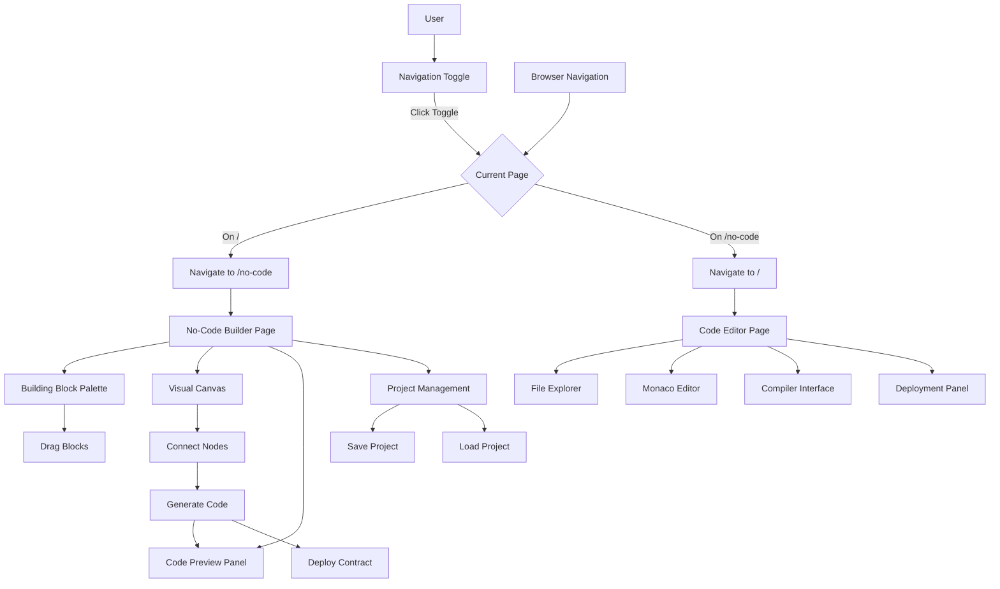
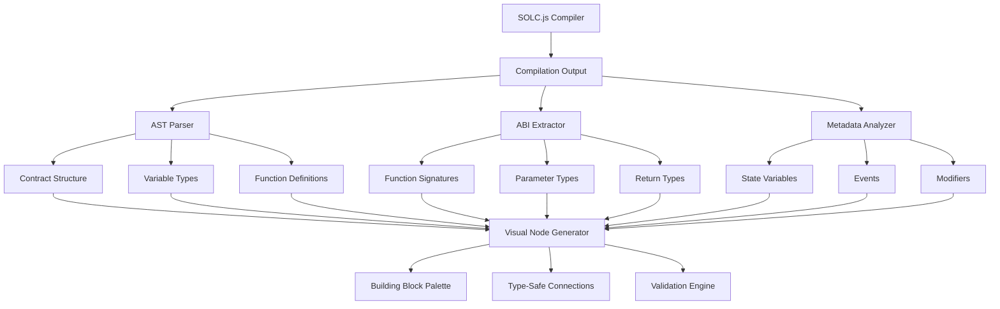
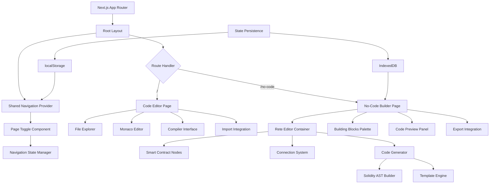

# SolMix No-Code Smart Contract Builder - Product Requirements Document

## 1. Product Overview

Extend the existing SolMix application with a visual, no-code smart contract builder that enables users to create smart contracts through drag-and-drop interactions. The feature introduces a dual-mode system where users can seamlessly switch between the traditional code editor and a visual node-based interface while maintaining all existing functionality.

* **Problem to solve:** Democratize smart contract development by providing a visual alternative to code-based development, making blockchain development accessible to non-programmers.

* **Target users:** Blockchain enthusiasts, business analysts, designers, and developers who prefer visual programming interfaces.

* **Market value:** Expand SolMix's user base by lowering the technical barrier to smart contract creation while maintaining professional-grade capabilities.

## 2. Core Features

### 2.1 User Roles

| Role           | Registration Method             | Core Permissions                                                           |
| -------------- | ------------------------------- | -------------------------------------------------------------------------- |
| Developer      | Direct access (no registration) | Full access to both Code Editor and No-Code modes, deployment capabilities |
| Visual Builder | Direct access (no registration) | Primary focus on No-Code mode with code preview access                     |

### 2.2 Feature Module

Our SolMix No-Code Builder consists of the following main pages:

1. **Code Editor Page (/)**: Traditional SolMix functionality with file explorer, Monaco editor, compiler interface, and deployment tools.
2. **No-Code Builder Page (/no-code)**: Full-screen visual smart contract builder with building block palette, canvas workspace, real-time code generation, and integrated deployment.
3. **Shared Navigation**: Page toggle component that navigates between the two pages with state persistence across navigation.

### 2.3 Page Details

| Page Name                  | Module Name            | Feature description                                                                                       |
| -------------------------- | ---------------------- | --------------------------------------------------------------------------------------------------------- |
| Shared Navigation          | Page Toggle            | Navigate between Code Editor (/) and No-Code (/no-code) pages, persist user preference across sessions    |
| Code Editor Page (/)       | Traditional Interface  | Maintain all existing SolMix functionality - file explorer, Monaco editor, compiler, deployment           |
| Code Editor Page (/)       | Import Integration     | Import and edit contracts generated from No-Code Builder page                                             |
| No-Code Builder (/no-code) | Building Block Palette | Drag-and-drop palette with State Variables, Functions, Events, Require Statements, ERC20/ERC721 templates |
| No-Code Builder (/no-code) | Visual Canvas          | Full-screen Rete.js workspace for arranging and connecting smart contract components                      |
| No-Code Builder (/no-code) | Node Connection System | Connect building blocks with draggable edges to define logic flow and dependencies                        |
| No-Code Builder (/no-code) | SOLC.js Type System    | Leverage existing SOLC.js integration for real-time type validation, AST parsing, and ABI-based type inference |
| No-Code Builder (/no-code) | Code Generation Engine | Real-time Solidity code generation based on node arrangement and connections with SOLC.js type checking   |
| No-Code Builder (/no-code) | Code Preview Panel     | Side-by-side display of generated Solidity code with syntax highlighting                                  |
| No-Code Builder (/no-code) | Project Management     | Save/load node-based projects using IndexedDB, export generated code                                      |
| No-Code Builder (/no-code) | Deployment Integration | Deploy generated contracts using existing SolMix deployment infrastructure                                |
| Both Pages                 | State Persistence      | Maintain user work and preferences across page navigation using localStorage and IndexedDB                |

## 3. Core Process

### Page Navigation Flow

1. User starts on the main SolMix page (/) with the traditional code editor
2. User clicks the toggle in the navigation header to switch to No-Code mode
3. System navigates to the No-Code Builder page (/no-code) with loading state
4. User's work and preferences are preserved across navigation
5. User can navigate back to Code Editor using the toggle or browser navigation

### No-Code Builder Page Flow (/no-code)

1. User lands on dedicated No-Code Builder page with full-screen visual interface
2. User drags building blocks from the palette to the canvas
3. User connects blocks using draggable edges to define contract logic
4. System generates Solidity code in real-time and displays in preview panel
5. User can save the project to IndexedDB for later editing
6. User deploys the generated contract using the integrated deployment button
7. User can navigate back to Code Editor page (/) to work with traditional interface

### Code Editor Page Flow (/)

1. User works with the traditional SolMix interface on the main page
2. User can navigate to No-Code Builder page (/no-code) via toggle
3. User maintains access to all existing features and workflows
4. Generated contracts from No-Code mode can be imported and edited

## 4. User Interface Design

### 4.1 Design Style

* **Primary colors:** Maintain existing SolMix dark theme (#000000 background, #1a1a1a panels)

* **Secondary colors:** Accent colors for nodes (#3b82f6 for functions, #10b981 for variables, #f59e0b for events)

* **Button style:** Consistent with existing SolMix rounded buttons with hover effects

* **Font:** Inter font family, 14px base size for readability

* **Layout style:** Split-panel layout for No-Code mode (palette + canvas + preview), maintain existing layout for Code Editor

* **Icons:** Lucide React icons for consistency, custom node icons for building blocks

### 4.2 Page Design Overview

| Page Name                  | Module Name            | UI Elements                                                                                        |
| -------------------------- | ---------------------- | -------------------------------------------------------------------------------------------------- |
| Shared Navigation          | Page Toggle            | Toggle switch in navigation header, page transition loading states, current page indicator         |
| Code Editor Page (/)       | Traditional Interface  | Existing SolMix layout - file explorer sidebar, Monaco editor, compiler panel, deployment controls |
| Code Editor Page (/)       | Import Integration     | "Import from No-Code" button, generated contract file indicators, cross-page data sync             |
| No-Code Builder (/no-code) | Building Block Palette | Full-height sidebar with categorized blocks, search functionality, drag indicators                 |
| No-Code Builder (/no-code) | Visual Canvas          | Full-screen infinite canvas with zoom/pan controls, grid background, connection guides             |
| No-Code Builder (/no-code) | Node Components        | Rounded rectangles with input/output sockets, color-coded by type, inline editing                  |
| No-Code Builder (/no-code) | Code Preview Panel     | Resizable side panel with Monaco editor, syntax highlighting, export functionality                 |
| No-Code Builder (/no-code) | Page Toolbar           | Save/load buttons, export to code editor, deployment controls, canvas utilities                    |

### 4.3 Responsiveness

Desktop-first design optimized for large screens with complex node arrangements. Mobile-adaptive considerations for tablet use with touch-friendly node manipulation and responsive panel layouts.

## 5. SOLC.js Integration Strategy

### 5.1 Type System Integration

Leverage the existing SolMix SOLC.js infrastructure to provide intelligent type extraction and validation for the no-code builder:

* **AST Parsing:** Extract contract structure, variable types, function signatures, and mappings from SOLC.js compilation output
* **ABI Analysis:** Use Application Binary Interface data to inform function parameter types and return values for visual nodes
* **Type Validation:** Integrate with existing Solidity language client for real-time type checking and completion
* **Compilation Output:** Parse contract metadata to automatically generate building blocks from existing Solidity code

### 5.2 Data Type Extraction Pipeline

### 5.3 Solidity Type Mapping

| Solidity Type | Node Representation | Validation Rules |
|---------------|--------------------|-----------------|
| `uint256`, `int256` | Number Input Node | Range validation, overflow checks |
| `address` | Address Input Node | Checksum validation, ENS resolution |
| `bool` | Boolean Toggle Node | True/false state management |
| `string`, `bytes` | Text Input Node | Length limits, encoding validation |
| `mapping(K => V)` | Mapping Node | Key-value type enforcement |
| `struct` | Composite Node | Nested field validation |
| `enum` | Selection Node | Predefined option validation |
| `function` | Function Node | Parameter/return type matching |

## 6. Technical Architecture

### 6.1 Page-Based Architecture

### 5.2 Route Definitions

| Route    | Purpose                                                                                     |
| -------- | ------------------------------------------------------------------------------------------- |
| /        | Code Editor page - Traditional SolMix interface with file explorer, Monaco editor, compiler |
| /no-code | No-Code Builder page - Full-screen visual smart contract builder with Rete.js editor        |
| /api/\*  | API routes for deployment and compilation services (existing)                               |

### 5.3 Data Flow

1. **Page Navigation:** Next.js App Router with shared navigation state using React Context and localStorage
2. **Cross-Page State Persistence:** User preferences and work preserved across page navigation using localStorage and IndexedDB
3. **Node Data Management:** Rete.js editor state with custom serialization for IndexedDB storage on /no-code page
4. **Code Generation:** Real-time transformation from node graph to Solidity AST to code string on /no-code page
5. **Project Import/Export:** Seamless data sharing between pages - import generated contracts to code editor, export existing code to visual builder
6. **Unified Deployment:** Shared deployment pipeline works from both pages using existing SolMix infrastructure

### 5.4 Key Technologies

* **Rete.js v2:** Visual node editor framework

* **React 18:** UI framework with existing SolMix integration

* **TypeScript:** Type safety for complex node definitions

* **IndexedDB:** Client-side project storage

* **Monaco Editor:** Code preview with Solidity syntax highlighting

* **Tailwind CSS:** Consistent styling with existing SolMix theme

## 6. Implementation Phases

### Phase 1: Foundation (Week 1-2)

* Mode toggle component and state management

* Basic Rete.js editor integration

* Simple node types (State Variable, Function)

### Phase 2: Core Functionality (Week 3-4)

* Complete building block palette

* Node connection system

* Basic code generation

### Phase 3: Advanced Features (Week 5-6)

* Real-time code preview

* Project persistence

* ERC20/ERC721 templates

### Phase 4: Integration & Polish (Week 7-8)

* Deployment integration

* UI/UX refinements

* Testing and optimization

## 7. Success Metrics

* **User Adoption:** 30% of users try No-Code mode within first month

* **Engagement:** Average session time increases by 25%

* **Contract Creation:** 15% of deployed contracts originate from No-Code mode

* **User Retention:** Mode switching users show 40% higher retention rate

## 8. Risk Mitigation

* **Performance:** Implement efficient node rendering and code generation algorithms

* **Complexity:** Start with essential building blocks, expand based on user feedback

* **Integration:** Maintain strict separation between modes to prevent breaking existing functionality

* **User Experience:** Conduct usability testing for intuitive drag-and-drop interactions

